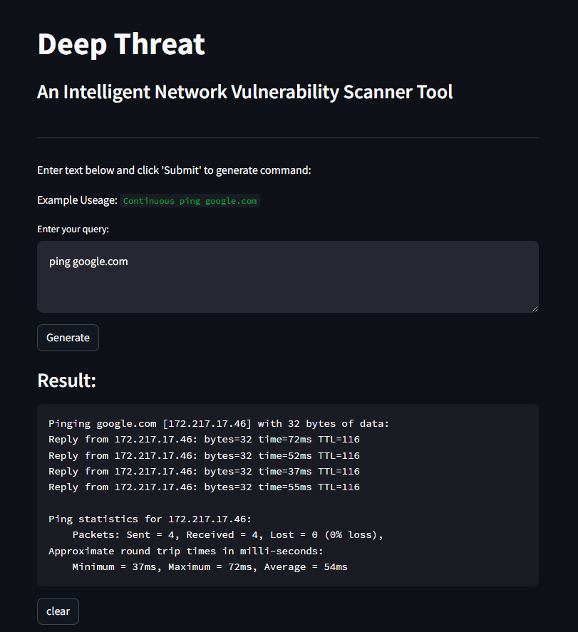

# Deep-Threat
An Intelligent Network Vulnerability Scanner Tool


## Usage
```bash
git clone https://github.com/ararchieves/Deep-Threat.git
cd Deep-Threat

pip install -r requirements.txt

ren template.env .env
## Add Keys in .env file

streamlit run app.py
```

## App Preview


